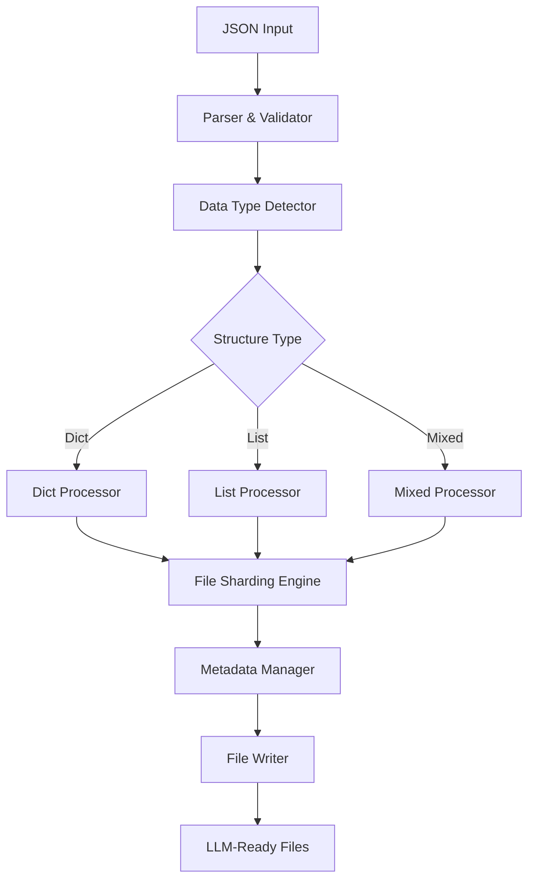

# JSON Transformer

A bidirectional JSON transformation tool that converts between compact von Neumann machine-readable JSON format and distributed LLM-readable file structures.

## 🚀 Features

- **Unflatten**: Convert compact JSON to multiple LLM-readable files with configurable size limits
- **File Sharding**: Intelligent splitting using linked-list concepts to maintain data relationships
- **Stable Schema**: Consistent file structure optimized for LLM processing
- **Size Control**: Configurable file size limits (default 90KB, optimized for LLM context windows)
- **Multiple Data Types**: Handles dict-of-dicts, lists, and mixed structures
- **Metadata Management**: Comprehensive linking and relationship tracking
- **Error Handling**: Robust error handling with recovery capabilities
- **Performance Optimized**: Parallel processing, streaming, and memory-efficient algorithms
- **Advanced Sharding**: Adaptive overhead calculation and optimal shard utilization
- **Compression Ready**: Built-in support for compression optimizations

## 📦 Installation

```bash
# Install in development mode
pip install -e .

# Install with development dependencies
pip install -e ".[dev]"
```

## 🔧 Usage

### Programmatic API

```python
import asyncio
from json_transformer import JSONTransformer

async def example():
    # Create transformer instance with advanced optimizations
    transformer = JSONTransformer(
        default_max_size=92160,  # 90KB optimal for LLM processing
        enable_parallel_processing=True,
        enable_compression=True,
        memory_limit_mb=2048  # 2GB memory limit
    )
    
    # Sample JSON data
    data = {
        "users": {
            "user1": {"name": "Alice", "age": 30},
            "user2": {"name": "Bob", "age": 25}
        },
        "posts": [
            {"id": 1, "title": "Hello World", "author": "user1"},
            {"id": 2, "title": "Python Tips", "author": "user2"}
        ]
    }
    
    import json
    json_string = json.dumps(data)
    
    # Unflatten JSON to files
    result = await transformer.unflatten(
        json_string=json_string,
        max_size=92160,  # 90KB chunks
        output_dir="./output"
    )
    
    if result.success:
        print(f"✅ Created {result.file_count} files")
        print(f"📁 Output directory: {result.output_directory}")
        print(f"📊 Total size: {result.total_size} bytes")
    else:
        print("❌ Failed:", result.errors)

# Run the example
asyncio.run(example())
```

### Command Line Interface

```bash
# Unflatten JSON file to multiple LLM-readable files
json-transformer unflatten input.json --size 25000 --output ./output

# Flatten directory back to JSON (when implemented)
json-transformer flatten ./output --output result.json

# Get help
json-transformer --help
```

### Quick Example

Run the included example script:

```bash
python example.py
```

## 📄 File Schema

The tool creates files with a stable schema optimized for LLM processing:

```json
{
  "_metadata": {
    "shardId": "shard_001",
    "parentId": "shard_000",
    "childIds": ["shard_002", "shard_003"],
    "dataType": "dict",
    "originalPath": ["users", "profiles"],
    "nextShard": "shard_002",
    "previousShard": null,
    "version": "1.0.0"
  },
  "data": {
    "name": "Alice",
    "age": 30,
    "email": "alice@example.com"
  }
}
```

### Index File

An `_index.json` file is created to provide an overview:

```json
{
  "version": "1.0.0",
  "created_at": "2024-01-01T12:00:00",
  "total_shards": 5,
  "root_shard": "shard_001",
  "data_structure": "mixed",
  "shards": [
    {
      "shard_id": "shard_001",
      "filename": "shard_001_dict.json",
      "data_type": "dict",
      "original_path": [],
      "parent_id": null,
      "child_ids": ["shard_002", "shard_003"],
      "size": 1024
    }
  ]
}
```

## 🏗️ Architecture

### Core Components

1. **JSONTransformer**: Main interface orchestrating the transformation
2. **Processors**: Specialized handlers for different data structures
   - `DictProcessor`: Handles dictionary-of-dictionaries
   - `ListProcessor`: Handles list/array structures  
   - `MixedProcessor`: Handles mixed structures
3. **FileShardingEngine**: Manages size-based data splitting
4. **MetadataManager**: Handles relationship tracking and linking
5. **FileWriter**: Manages output file creation and organization

### Processing Flow



## 🧪 Development

### Setup

```bash
# Install development dependencies
pip install -e ".[dev]"
```

### Testing

```bash
# Run all tests
pytest

# Run with coverage
pytest --cov=json_transformer --cov-report=html

# Run specific test file
pytest tests/test_integration.py -v
```

### Code Quality

```bash
# Format code
black src/ tests/
isort src/ tests/

# Type checking
mypy src/

# Linting
flake8 src/ tests/
```

## 📁 Project Structure

```
src/json_transformer/
├── __init__.py              # Package exports
├── types.py                 # Type definitions and interfaces
├── json_transformer.py     # Main transformer implementation
├── parser.py               # JSON parsing and validation
├── data_type_detector.py   # Structure analysis
├── error_handler.py        # Error handling and recovery
├── models/                 # Data models
│   ├── file_shard.py       # Shard representation
│   ├── shard_metadata.py   # Metadata structure
│   └── global_metadata.py  # Global transformation info
├── processors/             # Data structure processors
│   ├── dict_processor.py   # Dictionary processor
│   ├── list_processor.py   # List processor
│   └── mixed_processor.py  # Mixed structure processor
├── engines/                # Core processing engines
│   ├── file_sharding_engine.py  # Size-based splitting
│   └── metadata_manager.py      # Relationship management
├── utils/                  # Utility functions
│   ├── size_calculator.py  # Size calculation utilities
│   └── validation.py       # Validation utilities
└── io/                     # File I/O operations
    └── file_writer.py      # File writing utilities

tests/                      # Comprehensive test suite
├── conftest.py            # Test configuration
├── test_integration.py    # End-to-end tests
└── test_*.py             # Component tests
```

## 🔄 How It Works

### Unflatten Process

1. **Parse & Validate**: Parse JSON and validate structure
2. **Detect Type**: Identify data structure (dict-of-dicts, list, mixed)
3. **Process**: Route to appropriate processor based on structure
4. **Shard**: Split data respecting size constraints
5. **Link**: Generate metadata with hierarchical and sequential links
6. **Write**: Create files with stable schema

### Data Structure Handling

- **Dict-of-Dicts**: Creates separate files for nested dictionaries
- **Lists**: Maintains order through sequential linking
- **Mixed**: Intelligently routes different data types to appropriate processors

### Linking Strategy

- **Hierarchical Links**: Parent-child relationships for nested structures
- **Sequential Links**: Next/previous for ordered data (lists)
- **Reference Links**: Cross-references between related shards

## ⚡ Performance

- **Memory Efficient**: Streaming processing for large datasets
- **Size Optimized**: Configurable size limits for optimal LLM processing
- **Scalable**: Handles datasets from KB to GB range

## 🚧 Current Status

### ✅ Implemented
- Complete unflatten functionality
- All data structure processors (dict, list, mixed)
- File sharding with size constraints
- Metadata management and linking
- Comprehensive error handling
- File writing with stable schema
- CLI interface foundation
- Extensive test suite

### 🔄 In Progress
- Flatten functionality (reconstruction)
- File reading utilities
- Structure reconstruction engine

### 📋 Planned
- Performance optimizations
- Additional output formats
- Advanced LLM compatibility features

## 🤝 Contributing

1. Fork the repository
2. Create a feature branch
3. Make your changes with tests
4. Run the test suite
5. Submit a pull request

## 📄 License

MIT License - see LICENSE file for details.

## 🙏 Acknowledgments

This project implements file sharding and logical memory linked-list concepts to enable efficient processing of large JSON datasets by LLMs while maintaining data integrity and relationships.